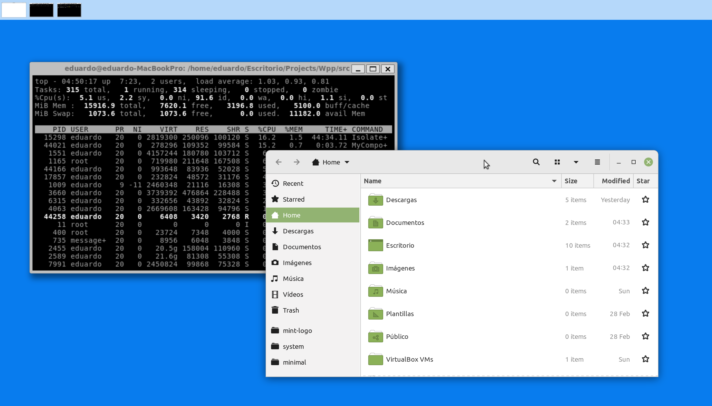

# Wayland++

A C++ library to create Wayland compositors with DRM and X11 backend support.

> :warning: **Currently under development.**

Wayland++ uses **libinput** and **evdev** for input listening and device discovering, **xkbcommon** for keyboard mapping and any version of **OpenGL** or **Vulkan** for painting (any **EGL** - compatible API).

## Libraries
`sudo apt install libwayland-dev libdrm-dev libgbm-dev libevdev-dev libinput-dev libegl-dev mesa-common-dev libgles2-mesa-dev libxkbcommon-dev libsoil-dev`

## Example

1. Add your user to the **input** and **video** groups and then reboot.
2. Compile the library and examples (the X11 backend is used by default).

```
$ cd Wpp/src
$ mkdir build
$ meson build
$ cd build
$ meson compile
```
3. Run the 'MyCompositor' example.
```
$ cd examples/MyCompositor
$ ./MyCompositor
```
4. Press fn + F2 to launch weston-terminal.



5. Press ESC to quit.

## Todo

### Protocols

* Wayland Interfaces
	* Compositor
		* create_surface ✅
		* create_region ✅
        * destroy ✅
    * Subcompositor
        * get_subsurface
        * destroy
    * Subsurface
        * set_desync
        * set_sync
        * place_below
        * place_above
        * set_position
        * destroy
	* Region
		* add ✅
		* subtract ✅
        * destroy ✅
	* Surface
		* attach ✅
        * offset
		* commit ✅
		* damage ✅
		* damage_buffer ✅
		* destroy ✅
		* frame ✅
		* set_buffer_scale ✅
		* set_buffer_transform
		* set_input_region
		* set_opaque_region
	* Seat
		* get_keyboard ✅
		* get_pointer ✅
		* get_touch
		* release ✅
	* Pointer
		* set_cursor ✅
		* release ✅
	* Keyboard
		* release ✅
	* Output
		* release ✅
	* Data Device Manager
		* create_data_source
		* get_data_device
        * ...

* XDG Shell Interfaces
	* Xdg wm-base
		* create_positioner
		* destroy ✅
		* get_xdg_surface ✅
		* pong
	* Xdg surface
		* ack_configure
		* destroy
		* get_popup ✅
		* get_toplevel ✅
		* set_window_geometry
	* Xdg toplevel
		* destroy
		* move ✅
		* resize ✅
		* set_app_id ✅
		* set_fullscreen
		* set_max_size ✅
		* set_maximized
		* set_min_size ✅
		* set_minimized
		* set_parent ✅
		* set_title ✅
		* show_window_menu
		* unset_fullscreen
		* unset_maximized
	* Xdg popup
		* destroy
		* grab ✅
		* reposition ✅
    * Xdg positioner
		* destroy ✅
		* set_size ✅
		* set_anchor_rect ✅
        * set_anchor ✅
        * set_gravity ✅
        * set_constraint_adjustment ✅
        * set_offset ✅
        * set_reactive
        * set_parent_size
        * set_parent_configure
* Presentation Time Interfaces
* Viewporter Interfaces
* zxdg_decoration_manager_v1

### Buffer Sharing Mechanisms
* Shared Memory ✅
* EGL ✅
* KMS

### Input Support
* Pointer ✅
* Keyboard ✅
* Touch

### Supported Rendering APIs
* OpenGL ES 2 ✅
* OpenGL ES 3
* OpenGL 3.x
* OpenGL 4.x
* Vulkan

### Performance
* Multithreading ✅
* DRM Hardware Cursor ✅


### Compatibility
* XWayland Support


