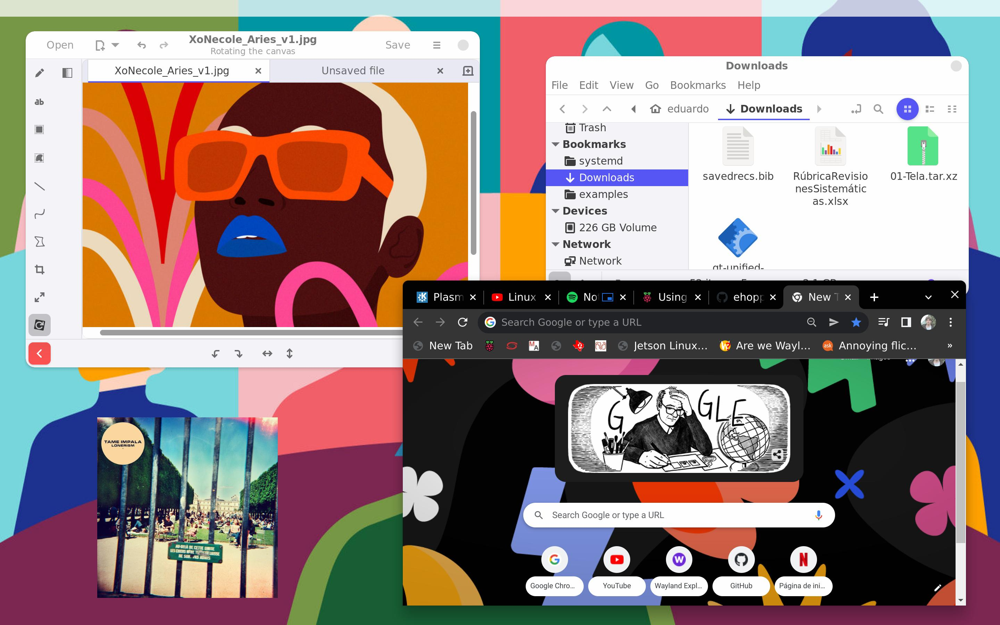

<h1 style="margin-top:0px;padding-top:0px">Louvre</h1>

A free and open source C++ library to create Wayland compositors.

<hr>

> 🔨 **Currently under development !!**

<hr>

## 📚 Dependencies
```
$ sudo apt install libwayland-dev libdrm-dev libgbm-dev libevdev-dev libxcursor-dev libxfixes-dev libinput-dev libegl-dev mesa-common-dev libgles2-mesa-dev libxkbcommon-dev libsoil-dev weston
```

## ✍️ Example

1. Add your user to the **input** and **video** groups and then reboot.
2. Compile the library and examples (the X11 backend is used by default).

```
$ cd Wpp/src
$ mkdir build
$ meson build
$ cd build
$ meson compile
```
3. Run the 'Minimal' example.
```
$ cd examples/Minimal
$ ./Minimal
```
4. Press F1 to launch weston-terminal.



5. Press F7 to quit.

## 💻 Backends

* X11 :white_check_mark:
* DRM/KMS :white_check_mark:

## 🧩 Protocols

* Wayland :white_check_mark:
* XDG Shell :white_check_mark:
* XDG Decoration Manager
* XDG Output
* WP Viewporter
* WP Pointer Gestures

## 💬 Buffer Sharing Mechanisms
* Shared Memory :white_check_mark:
* EGL :white_check_mark:
* KMS 

## 🕹️ Input Support
* Pointer :white_check_mark:
* Keyboard :white_check_mark:
* Touch

## 🖌️ Supported Rendering APIs
* OpenGL ES 2 :white_check_mark:
* OpenGL ES 3
* OpenGL 3.x
* OpenGL 4.x
* Vulkan

## ⏲️ Performance
* Multithreading :white_check_mark:
* DRM Hardware Cursor :white_check_mark:
* DRM Planes

## 👴 Compatibility
* GTK Clients :white_check_mark:
* Ozone Clients (Chromium) :white_check_mark:
* Qt 5.x Clients :white_check_mark: (Only tooltips reposition bug)
* Qt 6.x Clients :white_check_mark: (Only xdg_popup position bug)
* SDL :white_check_mark:
* EFL :white_check_mark:
* XWayland

## 🔨 TODO
* Implement wl_data_device
* Free output resources
* Check wl_keyboard v7 keymap MAP_PRIVATE & MAP_SHARED
* Implement wl_touch
* Implement zxdg_output_manager_v1
* Implement wp_viewporter
* Implement zxdg_decoration_manager_v1
* Implement zwp_pointer_gestures_v1
* Recheck wl_surface interface implementation
* LCursor autoupdate toggle
* LCursor hw_rendering toggle
* LCursor gen X11 cursor textures
* Class for output interframe and surface damage calculation
